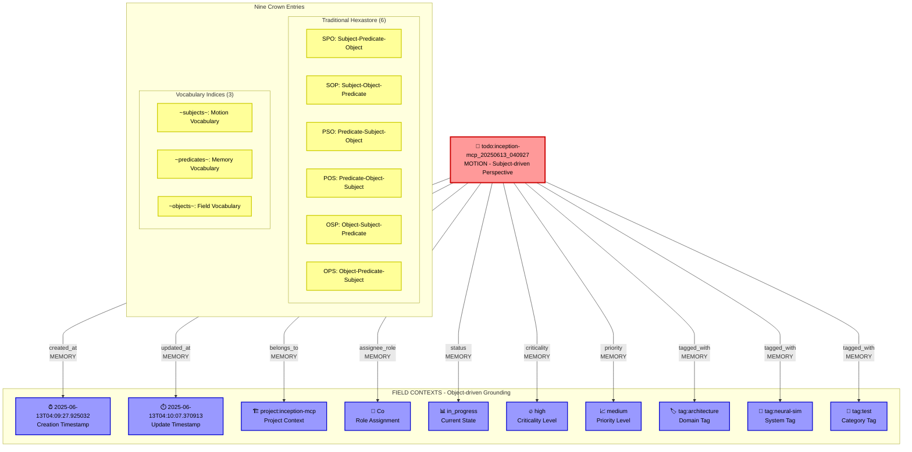

# Implementing a Todo System with LabDb

A practical guide to building triadic perspective applications using LabDb9's nonostore architecture.

## Overview

This document demonstrates how to implement a todo management system using LabDb09's triadic perspective principles. You'll learn how to structure data across the **Motion/Memory/Field** dimensions and leverage the **nine-index crown architecture** for optimal query performance.

## Triadic Perspective Mapping

LabDb organizes data according to three fundamental perspectives:

- **Motion (स्पन्द)**: Subject-driven reality - entities that act and express
- **Memory (स्मृति)**: Predicate-driven connections - relationships that link and pattern  
- **Field (क्षेत्र)**: Object-driven contexts - grounding points that receive and contextualize

## Todo Entity Structure

### Core Entity Design

A todo in LabDb is structured as a **Motion entity** that expresses itself through various **Memory relations** into **Field contexts**:

```cpp
// Central Motion Entity
std::string todo_id = "todo:inception-mcp_20250613_040927";

// Motion-driven connections
store->connect(todo_id, "created_at", "2025-06-13T04:09:27.925032");
store->connect(todo_id, "updated_at", "2025-06-13T04:10:07.370913");
store->connect(todo_id, "belongs_to", "project:inception-mcp");
store->connect(todo_id, "assignee_role", "Co");
store->connect(todo_id, "status", "in_progress");
store->connect(todo_id, "criticality", "high");
store->connect(todo_id, "priority", "medium");
store->connect(todo_id, "tagged_with", "tag:architecture");
store->connect(todo_id, "tagged_with", "tag:neural-sim");
store->connect(todo_id, "tagged_with", "tag:test");
```

## Triadic Architecture Visualization



## Implementation Guide

### 1. Basic Todo Operations

```cpp
#include "LabDb/NonoStore.h"
#include "LabDb/TriadicQuery.h"

// Initialize database
auto store = std::make_shared<LabDb::NonoStore>("todos.lmdb");
LabDb::TriadicQuery query(store);

// Create a new todo
std::string todo_id = "todo:user_task_" + generate_timestamp_id();
store->connect(todo_id, "rdf:type", "entity:todo");
store->connect(todo_id, "content", "Implement triadic query interface");
store->connect(todo_id, "created_at", current_timestamp());
store->connect(todo_id, "status", "planned");
store->connect(todo_id, "priority", "high");
```

### 2. Motion-Driven Queries (Subject-Centric)

Query what a specific todo expresses:

```cpp
// What does this todo express?
auto todo_properties = query.motion_from("todo:user_task_123");

// What todos are assigned to a specific role?
auto role_todos = query.motion_through("assignee_role");
```

### 3. Memory-Driven Queries (Relationship-Centric)

Query relationship patterns:

```cpp
// Find all todos with specific status
auto status_relations = query.memory_relations("status");

// Find relationship frequencies
auto freq_analysis = query.relation_frequencies();
```

### 4. Field-Driven Queries (Context-Centric)

Query grounding contexts:

```cpp
// What todos ground into this project?
auto project_todos = query.field_contexts("project:inception-mcp");

// What are the primary contexts for todo grounding?
auto primary_contexts = query.primary_contexts();
```

## Data Distribution Patterns

### The Curious Dichotomy

When implementing a todo system in LabDb9, you'll observe an interesting distribution pattern:

- **Motion Entities**: Hundreds (todos, projects, users)
- **Memory Relations**: Dozens (created_at, belongs_to, tagged_with, etc.)
- **Field Contexts**: Thousands (timestamps, status values, tags, priorities)

**Why this happens**: Each todo creates multiple **temporal grounding points** (timestamps) and **categorical contexts** (tags, statuses), naturally leading to more Field contexts than Motion entities.

### Example Distribution

```bash
# Using the LabDb Explorer CLI tool
./labdb-explore todos.lmdb --stats

=== LabDb Triadic Statistics ===
Motion Entities (स्पन्द):     259 subjects    # todos, projects, users
Memory Relations (स्मृति):     35 predicates   # relationship types  
Field Contexts (क्षेत्र):       1092 objects    # timestamps, tags, values
Total Connections:           3735 triples
```

## Query Optimization

### Nine-Index Crown Architecture

LabDb automatically optimizes queries using nine indices:

**Hexastore Indices (6)**:
- SPO, SOP: Subject-driven queries (Motion perspective)
- PSO, POS: Predicate-driven queries (Memory perspective)  
- OSP, OPS: Object-driven queries (Field perspective)

**Vocabulary Indices (3)**:
- `~subjects~`: All Motion entities
- `~predicates~`: All Memory relations
- `~objects~`: All Field contexts

### Query Pattern Optimization

```cpp
// Optimized for SPO index (Motion perspective)
auto user_todos = store->query("user:alice", "*", "*");

// Optimized for PSO index (Memory perspective)  
auto high_priority = store->query("*", "priority", "high");

// Optimized for OSP index (Field perspective)
auto project_items = store->query("*", "*", "project:labdb");
```

## Advanced Patterns

### Temporal Consciousness

Leverage temporal grounding for time-aware queries:

```cpp
// Find todos created in a time range
auto recent_todos = store->query("*", "created_at", "2025-06-*");

// Time-based analytics
auto temporal_patterns = query.detect_relationship_clusters();
```

### Triadic Navigation

Navigate between perspectives:

```cpp
// Start with Motion, shift to Memory perspective
auto motion_results = query.motion_from("todo:task_123");
auto memory_view = query.perspective_shift(motion_results, 
                                          TriadicQuery::Perspective::Memory);

// Deep triadic traversal
auto exploration = query.triadic_traverse("todo:task_123", 3);
```

### Consciousness Analytics

```cpp
// Get triadic statistics
auto stats = query.get_triadic_stats();
std::cout << "Connectivity Ratio: " << stats.connectivity_ratio << std::endl;

// Find bridge entities (highly connected todos)
auto bridges = query.bridge_entities(5.0);

// Detect relationship clusters
auto clusters = query.detect_relationship_clusters();
```

## Best Practices

### 1. Entity Naming Conventions

Use consistent prefixes for different entity types:
- `todo:` for todo entities
- `project:` for project contexts
- `user:` for user entities
- `tag:` for categorization tags

### 2. Temporal Grounding

Always include temporal relationships:
- `created_at`: Entity creation timestamp
- `updated_at`: Last modification timestamp
- `due_at`: Deadline timestamp (for todos)

### 3. Hierarchical Organization

Structure projects and todos hierarchically:
```cpp
store->connect("todo:task_123", "belongs_to", "project:labdb");
store->connect("project:labdb", "part_of", "portfolio:lab");
```

### 4. Rich Categorization

Use multiple tagging dimensions:
```cpp
store->connect("todo:task_123", "tagged_with", "tag:architecture");  // domain
store->connect("todo:task_123", "tagged_with", "tag:urgent");        // urgency
store->connect("todo:task_123", "tagged_with", "tag:backend");       // component
```

## Exploration Tools

Use the LabDb Explorer CLI for investigation:

```bash
# Database overview
./labdb-explore todos.lmdb --stats

# Sample entities by perspective
./labdb-explore todos.lmdb --sample motion 10
./labdb-explore todos.lmdb --sample memory 5  
./labdb-explore todos.lmdb --sample field 20

# Explore specific entities
./labdb-explore todos.lmdb --explore "todo:task_123"

# Random sampling for discovery
./labdb-explore todos.lmdb --random field 15
```

## Conclusion

LabDb's triadic perspective architecture provides a powerful foundation for todo systems that naturally models tasks, relationships, and contexts. The nine-index crown architecture ensures optimal query performance while maintaining ontological completeness.

*For more information on triadic perspective principles, see [theoretical-grounding.md](theoretical-grounding.md).*
